# ML OpsHub

## 🚀 Makine Öğrenimi Operasyonları için Entegre Platform

**ML OpsHub**, veri bilimi ve makine öğrenimi projelerinizin tüm yaşam döngüsünü tek bir yerde yönetmenizi sağlayan modern, ölçeklenebilir ve kullanıcı dostu bir platformdur. Veri yüklemeden model eğitimine, model yönetiminden raporlamaya kadar tüm süreçleri kolayca yönetin.

---

## İçindekiler
- [Özellikler](#özellikler)
- [Mimari](#mimari)
- [Klasör Yapısı](#klasör-yapısı)
- [Kurulum](#kurulum)
- [Kullanım](#kullanım)
- [Servisler](#servisler)
- [Katkı Sağlama](#katkı-sağlama)
- [Lisans](#lisans)

---

## Özellikler
- 📊 **Veri Analizi:** Yüklediğiniz veriler üzerinde otomatik analiz ve önişleme önerileri
- 🤖 **Model Eğitimi:** Farklı algoritmalarla model eğitimi ve değerlendirme
- 🗂️ **Model Yönetimi:** MLflow ile model kaydı, versiyonlama ve izleme
- 📝 **Raporlama:** Proje raporlarını yükleme, görüntüleme ve yönetme
- 🖥️ **Kullanıcı Arayüzleri:** Model yönetimi ve uçtan uca iş akışları için modern web arayüzleri
- ☁️ **Bulut Entegrasyonu:** MinIO ile obje depolama, MLflow ile model izleme
- 🐳 **Konteynerleştirme:** Docker ve Docker Compose ile kolay kurulum ve dağıtım

---

## Mimari

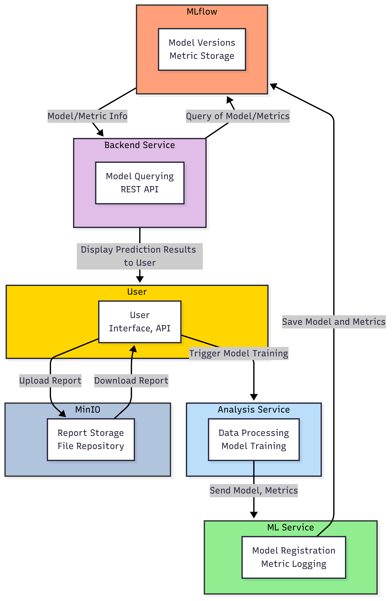

**Mimari Akış:**
- Tüm servisler mikroservis mimarisiyle izole ve ölçeklenebilir şekilde çalışır.
- Model ve veri yönetimi için MLflow ve MinIO entegre edilmiştir.
- Kullanıcı arayüzleri, veri analizi ve model yönetimi için iki farklı Streamlit tabanlı UI sunar.
- REST API’ler ile servisler arası iletişim sağlanır.
- Model ve rapor dosyaları MinIO üzerinde saklanır, model geçmişi ve metrikler MLflow ile izlenir.

---

## Klasör Yapısı

```
ML_OpsHub/
├── analysis-service/         # Veri analizi, önişleme, model eğitimi ve rapor yönetimi servisi
│   ├── src/
│   │   ├── api/              # REST API uç noktaları
│   │   ├── data/             # Veri yükleme ve önişleme modülleri
│   │   ├── models/           # Model eğitimi ve değerlendirme
│   │   ├── services/         # Eğitim servisleri
│   │   ├── storage/          # MinIO istemcisi
│   │   └── utils/            # Loglama ve yardımcı fonksiyonlar
│   └── ...
├── ml-service/               # MLflow tabanlı model yönetimi ve izleme servisi
│   ├── src/
│   │   ├── api/              # Model kaydı, metrik sorgulama API'leri
│   │   ├── services/         # MLflow istemcisi
│   │   ├── utils/            # Loglama
│   │   └── config/           # Konfigürasyon
│   └── ...
├── backend-service/          # ML OpsHub servisleri arasında köprü API katmanı
│   ├── src/
│   │   ├── api/              # MLflow ve model yönetimi API'leri
│   │   ├── services/         # MLflow istemcisi ve entegrasyonlar
│   │   ├── utils/            # Loglama
│   │   └── config/           # Konfigürasyon
│   └── ...
├── model-management-ui/      # Model ve rapor yönetimi için Streamlit arayüzü
│   ├── pages/                # Model Explorer, Model Management, Report Management sayfaları
│   └── Main_Page.py          # Ana sayfa
├── ml-workflow-ui/           # Veri yükleme, analiz ve model eğitimi için Streamlit arayüzü
│   ├── ui/                   # data_upload, data_analysis, preprocessing, model_training modülleri
│   └── app.py                # Ana uygulama
├── docker-compose.yaml       # Tüm servislerin orkestrasyonu
└── ...
```

---

## Kurulum

### Gereksinimler
- Docker & Docker Compose
- 4GB+ RAM (tüm servisler için önerilir)

### Hızlı Başlangıç
1. **Projeyi klonlayın:**
   ```bash
   git clone https://github.com/arda92a/ML_OpsHub.git
   cd ml-opshub
   ```
2. **Tüm sistemi başlatın:**
   ```bash
   docker-compose up --build
   ```
3. **Arayüzlere erişin:**
   - **ML Workflow UI:** [http://localhost:8501](http://localhost:8501)
   - **Model Management UI:** [http://localhost:8502](http://localhost:8502)
   - **MinIO Paneli:** [http://localhost:9001](http://localhost:9001)  
     (Kullanıcı: `minioadmin`, Şifre: `minioadmin`)
   - **MLflow Tracking:** [http://localhost:5000](http://localhost:5000)

---

## Kullanım

### 1. Veri Yükleme ve Analiz
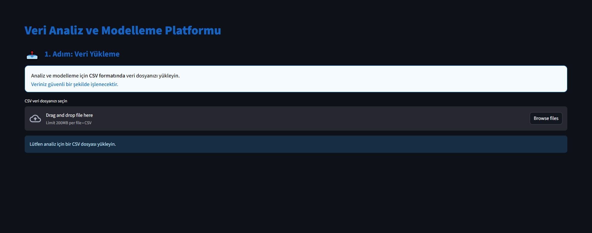
- CSV/XLSX dosyanızı yükleyin, otomatik analiz ve önişleme önerilerini görüntüleyin.

### 2. Veri Analizi ve Görselleştirme

#### Genel Veri Özeti
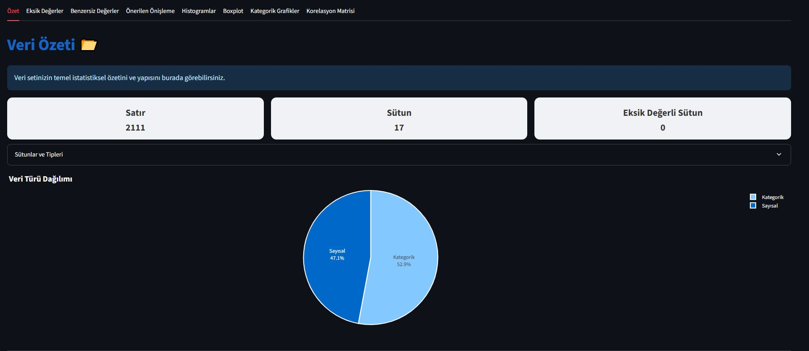
- Yüklenen veri setinin temel istatistiksel özetini ve genel yapısını görüntüleyebilirsiniz.

#### Eksik Değer Analizi
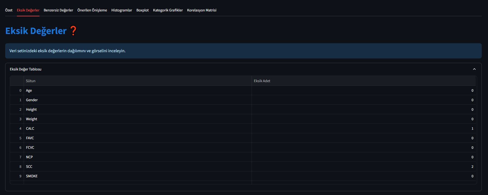
- Veri setindeki eksik değerlerin dağılımını ve oranlarını inceleyin.

#### Benzersiz Değer Analizi
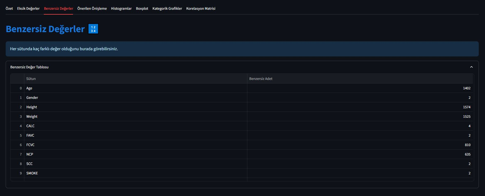
- Her sütundaki benzersiz değer sayılarını ve oranlarını analiz edin.

#### Kategorik Değişkenlerin Dağılımı
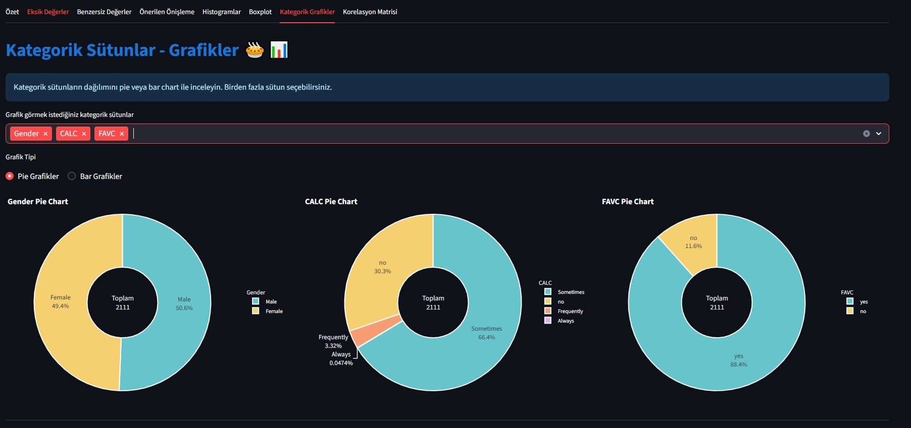
- Kategorik değişkenlerin pasta grafiği ile dağılımını görselleştirin.

#### Histogramlar
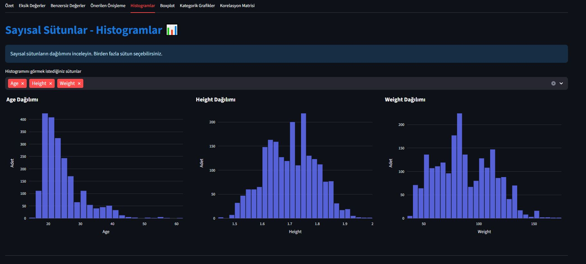
- Sayısal değişkenlerin dağılımını histogramlar ile analiz edin.

#### Önerilen Önişlemeler
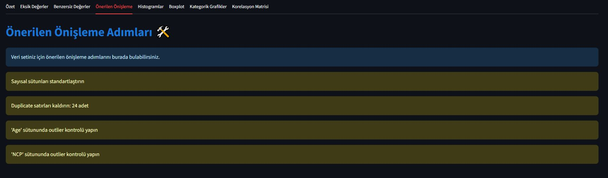
- Otomatik olarak önerilen önişleme adımlarını ve veri temizleme önerilerini görüntüleyin.

### 3. Model Eğitimi

#### Model Eğitim Arayüzü
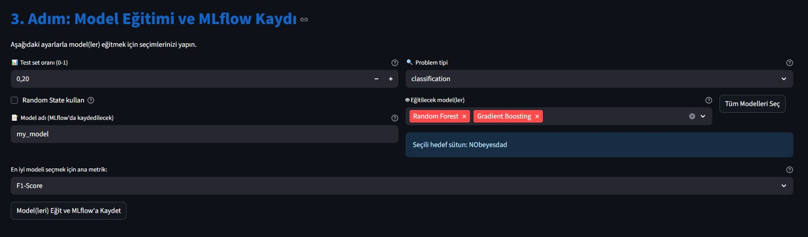
- Farklı algoritmalarla modelinizi eğitebileceğiniz kullanıcı dostu arayüz.

#### Karşılaştırma Sekmesi ve Sonuç Tablosu
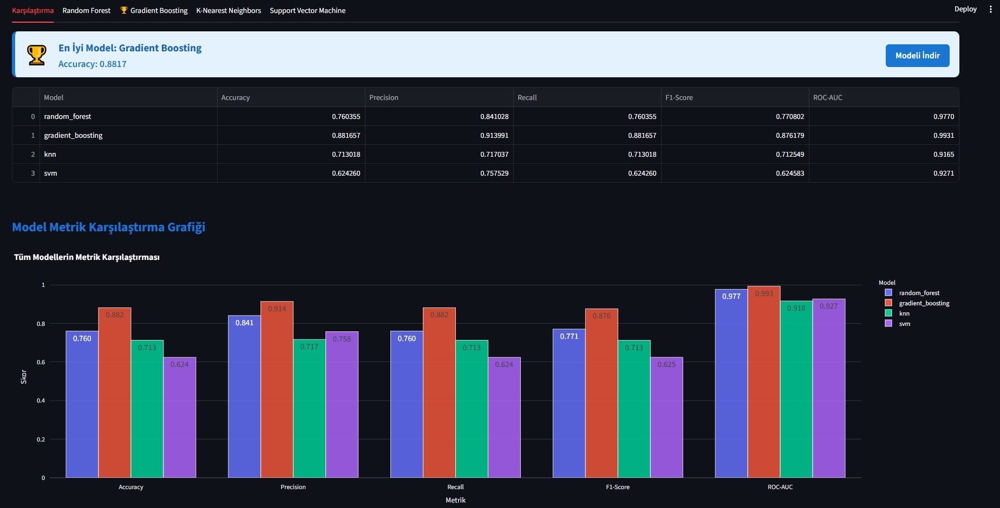
- Farklı modellerin başarı metriklerini ve karşılaştırma sonuçlarını tablo halinde analiz edin.

#### Model Sonuç Detayları
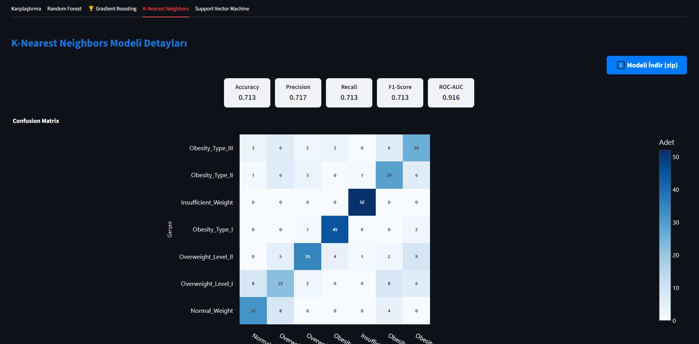
- Eğitilen modelin doğruluk, hata oranı, ROC eğrisi gibi detaylı metrik ve grafiklerini görüntüleyin.


### 4. Model Yönetimi
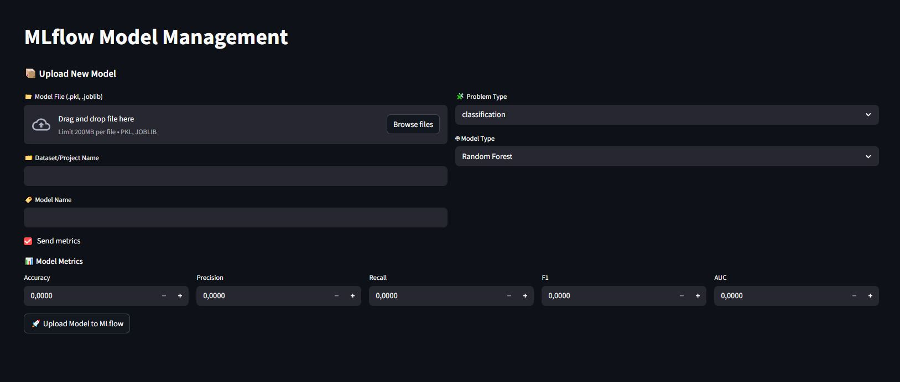
- Eğittiğiniz modelleri MLflow ile kaydedin, versiyonlayın ve izleyin.

### 5. Raporlama
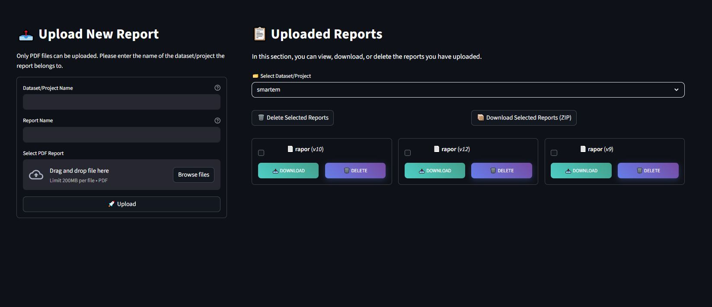
- Proje raporlarınızı yükleyin, yönetin ve ekibinizle paylaşın.

---

## Servisler

| Servis Adı                | Açıklama                                                                 |
|---------------------------|--------------------------------------------------------------------------|
| **analysis-service**      | Veri analizi, önişleme, model eğitimi ve rapor yönetimi servisi           |
| **ml-service**            | MLflow ile model yönetimi ve izleme servisi                              |
| **backend-service**       | ML OpsHub servisleri arasında köprü API katmanı                          |
| **model-management-ui**   | Model ve rapor yönetimi için modern web arayüzü                          |
| **ml-workflow-ui**        | Veri yükleme, analiz ve model eğitimi için uçtan uca iş akışı arayüzü    |
| **minio**                 | Obje depolama servisi (S3 uyumlu)                                        |
| **mlflow**                | Model izleme ve yönetimi için MLflow Tracking Server                     |

---

## Lisans
Bu proje MIT lisansı ile lisanslanmıştır.  
Daha fazla bilgi için [LICENSE](LICENSE) dosyasına bakabilirsiniz.

---

